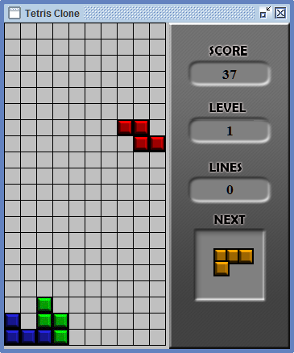

Java_Tetris_Clone
=================

## Screenshot

  

## About

  Basic implementation of the Tetris game with Swing GUI

## Controls

  * Arrow Key Up    -  rotate
  * Arrow Key Left  -  move left
  * Arrow Key Right -  move right
  * Arrow Key Down  -  move down
  * Spacebar        -  hard drop
  * P               -  pause game

## Features

  Mainly standard Tetris features
